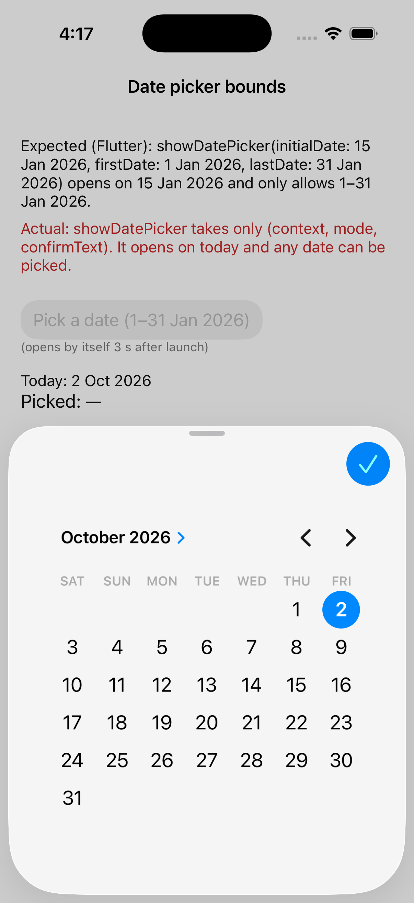
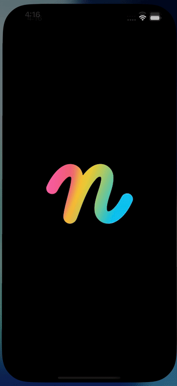

# Repro: `showDatePicker` has no `initialDate` / `firstDate` / `lastDate` (and no `showDateRangePicker`)

Issue: https://github.com/DartNative/dartnative/issues/59

DartNative 1.0.0's `showDatePicker` takes only `context`, `mode` and `confirmText`. The picker always opens on today and accepts any date, so a form can't open it on the field's current value or keep a pick inside a range (no future days, a report's month). There is no `showDateRangePicker` either.

## Run

`dn run` (iOS simulator; Android behaves the same unless stated).

## What you'll see

1. The screen states the bounds the app wants: open on 15 Jan 2026, allow 1–31 Jan 2026.
2. Three seconds after launch the picker opens by itself (the "Pick a date" button opens it again). It opens on today, not on 15 Jan 2026, and every day is enabled.
3. Pick any day and confirm: the screen shows "Picked: …" and, in red, "outside 1–31 Jan 2026".

## Expected

As in Flutter: the picker opens on `initialDate`, and days before `firstDate` or after `lastDate` are disabled (iOS `UIDatePicker.minimumDate` / `maximumDate`, Android `DatePicker.setMinDate` / `setMaxDate`).

## What we'd write in Flutter

```dart
final picked = await showDatePicker(
  context: context,
  initialDate: DateTime(2026, 1, 15),
  firstDate: DateTime(2026, 1, 1),
  lastDate: DateTime(2026, 1, 31),
);

final range = await showDateRangePicker(
  context: context,
  firstDate: DateTime(2020),
  lastDate: DateTime.now(),
);
```

On 1.0.0 neither compiles: `initialDate`, `firstDate` and `lastDate` aren't defined, and `showDateRangePicker` doesn't exist.

## Recording



 · [mp4](recording/ios.mp4)

## Environment

- DartNative 1.0.0 (SDK `113c27aacb2`, framework edition `7ae29132`), Dart 3.12.0
- macOS 26.7.1, Xcode 26.1.1
- iPhone 17 simulator, iOS 26.1
